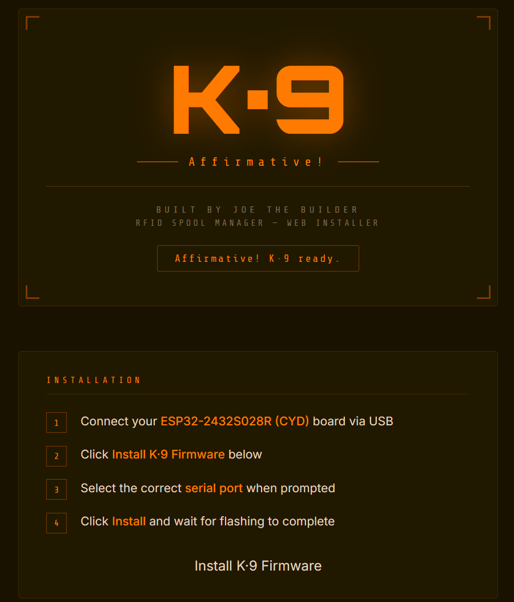
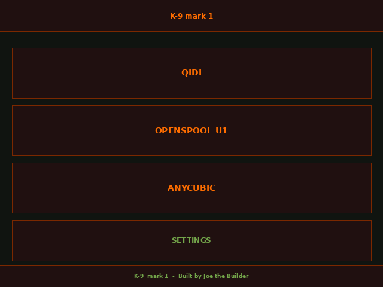
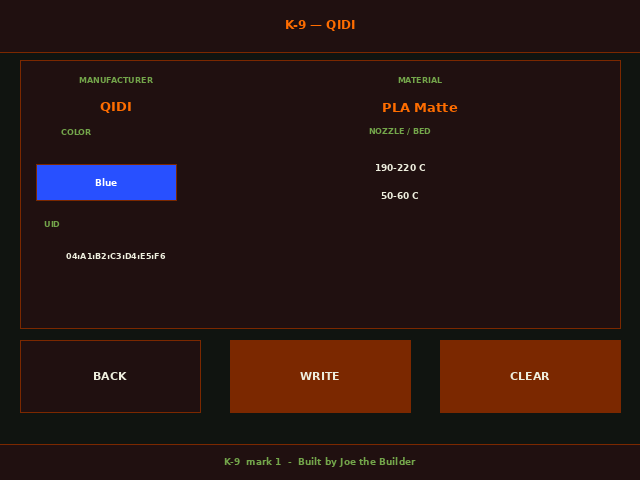
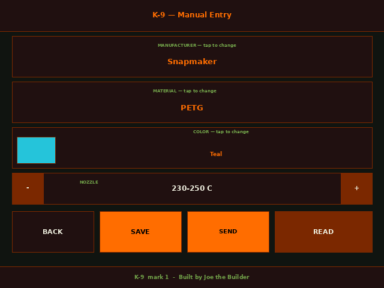
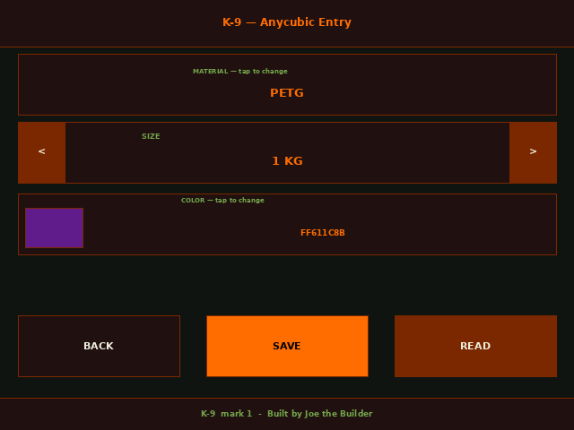
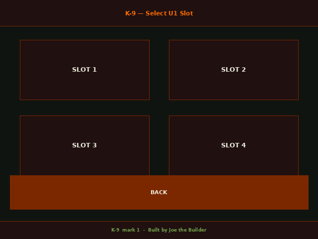
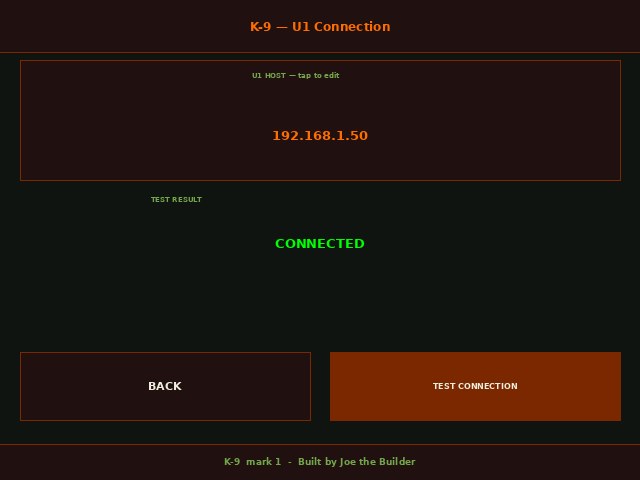

# K-9 mark1
ESP32 RFID spool management system for 3D printing (K-9 project)

---

> **Note on screenshots below**: the web installer images are real screenshots. The touchscreen UI images (Main Menu, QIDI, Anycubic, OpenSpool, U1 screens) are mockups generated directly from the firmware's actual layout coordinates and colors — not device photos yet. Will be swapped for real photos as they're taken.

## What This Is

K-9 is a dedicated spool management tool designed to:
- Read and write RFID/NFC filament tags
- Support multiple printer formats
- Send filament data directly to a Snapmaker U1 over WiFi
- Work with a local Spoolman server
- Expand into a full smart spool system over time

---

## Getting Started

1. **Flash the firmware** — use the [Web Installer](https://joethebuilder.github.io/K-9/web-flasher/) (Chrome or Edge only). Plug the board in over USB, click Install, follow the prompts. No Arduino IDE needed.  

3. **Connect WiFi** — Settings → WIFI → SCAN → tap your network → enter password if prompted. Credentials are saved and reconnect automatically after that.
4. **(Optional) Connect a Snapmaker U1** — Settings → U1 CONNECTION → enter your U1's IP address → TEST CONNECTION to confirm. Only needed if you want to use the SEND feature (see below).
5. **Pick a protocol from the Main menu** — QIDI, OpenSpool U1, or Anycubic — and follow the on-screen prompts to read or write a tag.

*Mockup rendered from the firmware's actual layout/colors — this is what you'll see once flashing is done.*

---

## Current Support

- **QIDI** — Mifare Classic 1K/4K, discrete color/material codes. Read/write confirmed working.

  

- **OpenSpool U1** — NTAG215, NDEF JSON, compatible with the Snapmaker U1's built-in OpenRFID tag reader. Read/write confirmed working.

  

- **Anycubic ACE** — NTAG215 raw-block format, full 35-color preset system. Read/write confirmed working.

  

- **U1 SEND** — push filament data (manufacturer/material/color) straight to a Snapmaker U1 ToolHead slot (1–4) over WiFi, no tag required. See the note below before relying on this.

  

---

## U1 SEND — Read This First

If your Snapmaker U1 is set to **OpenRFID** filament detection mode (Firmware Config → Filament Detection), SEND will be rejected with an error like `filament_config, official filament, not configurable!` on any slot where the printer has already detected and locked in a real tag as "official." SEND currently works reliably on **empty slots** with no tag actively detected. Switching your U1 to **External** mode removes this conflict, but disables the printer's own automatic tag detection entirely — a real tradeoff, not a quick fix. Full detail: `docs/protocols/u1-moonraker-macros.md`.

---

## Hardware

- ESP32-2432S028R (CYD)
- PN532 RFID/NFC reader (I2C — GPIO 27 → SDA, GPIO 22 → SCL)
- 2.8" ILI9341 TFT touchscreen (XPT2046 touch controller)
- Wi-Fi for U1 SEND and a future direct link to a Spoolman server

---

## Features

- Tag detection and handling across three protocols
- Send filament data over WiFi, no tag required (Snapmaker U1)
- Multi-format spool support
- Touch-driven interface with on-screen keyboard for WiFi/host entry
- Modular design for new printer systems
- Boot splash branding (K-9 mark1, Built by Joe the Builder)

---

## Known Limitations / In Progress

- U1 SEND only transmits manufacturer/material/color — no temperature range yet, and no `subtype` field on the entry screen yet
- U1 SEND has no filament-sensor / print-in-progress safety check before overwriting a slot
- OpenSpool U1's color picker currently reuses QIDI's 24-color list as a placeholder — should be the 35-color list instead (fix identified, not yet applied)
- Spoolman integration is planned but not yet built
- Anycubic ACE has no known network write path — this is a confirmed limitation of Anycubic's own protocol, not something K-9 can add. Tag writing is the only way to get data onto an ACE slot.

---

## Roadmap

- Spoolman API integration (UID-based spool linking)
- Filament-sensor safety check before U1 SEND
- OpenSpool U1 schema upgrade (`subtype`, `version`, `alpha` fields)
- Scale integration
- Mark 2: physical ACE-into-U1 hardware integration (separate from tag writing — Klipper/hardware plumbing, not in scope for Mark 1)

---

## Why This Exists

To build a simple, reliable way to track and manage filament spools across different printers without relying on closed ecosystems.

---

## Status

Active development — building step by step from a working base.

---

## Documentation

- `docs/PROJECT_NOTES.md` — full build history: what's confirmed working, what's been tried and abandoned, and why
- `docs/protocols/` — deep-dive reference docs on each protocol K-9 speaks (Anycubic ACE, U1 Moonraker macros, OpenSpool schema)
- `CHANGELOG.md` — version-by-version summary of fixes and features

---

## Reporting Issues

If something doesn't work as expected, please include:
- Which protocol/screen you were on
- What you tapped and what happened vs. what you expected
- Whether WiFi/U1 connection (if relevant) showed CONNECTED beforehand
- If a U1 SEND error occurs, the exact error text/code from the printer screen or Fluidd console

---

## License

MIT

---

## Web Installer

Click here to flash the ESP32:

https://joethebuilder.github.io/K-9/web-flasher/
